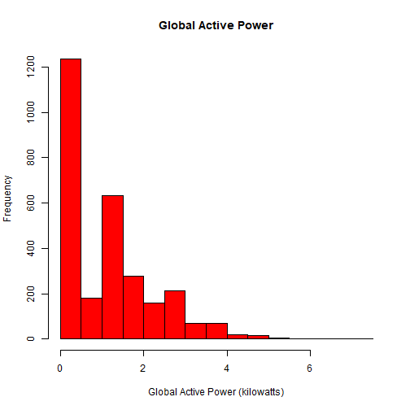
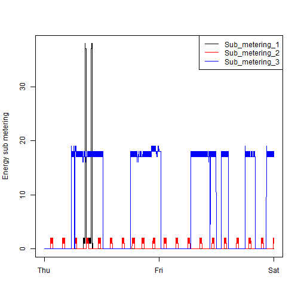
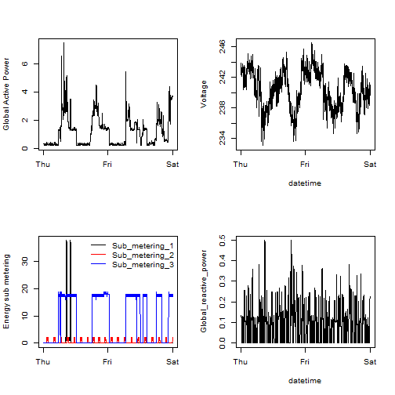

```{r, include=FALSE}
library(data.table, quietly = T)
library(lubridate, quietly = T)
library(dplyr, quietly = T)
```

### Plot 1
```{r Plot 1, echo=FALSE}
source("plot1.R")
```


### Plot 2
```{r Plot 2, echo=FALSE}
source("plot2.R")
```


### Plot 3
```{r Plot 3, echo=FALSE}
source("plot3.R")
```


### Plot 4
```{r Plot 4, echo=FALSE}
source("plot4.R")
```

